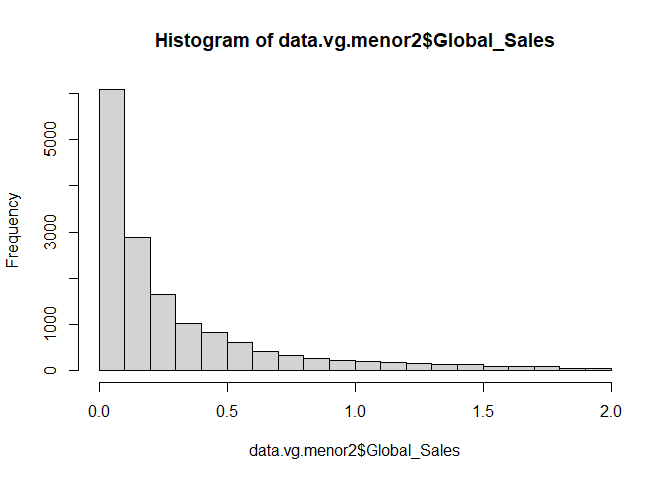
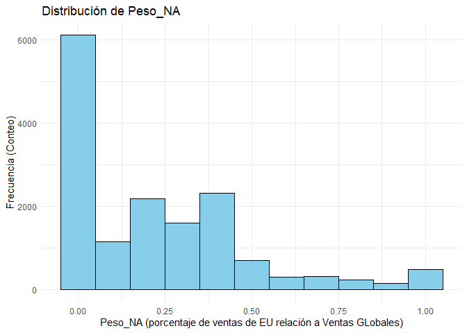
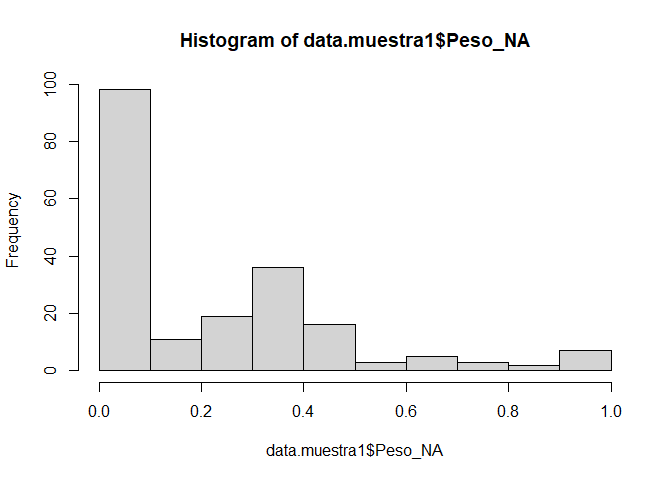
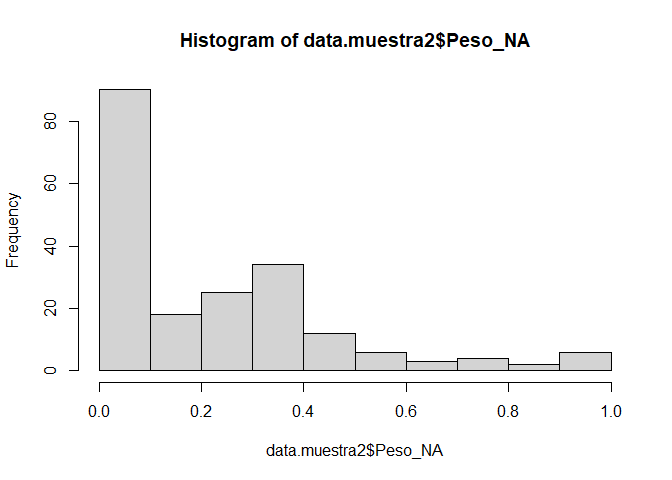
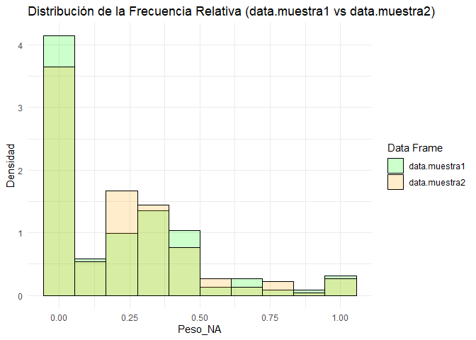

Basic Example
================
Boris Miranda
2025-14-10

# Librerias

``` r
library(ggplot2)
library(dplyr)
```

    ## 
    ## Attaching package: 'dplyr'

    ## The following objects are masked from 'package:stats':
    ## 
    ##     filter, lag

    ## The following objects are masked from 'package:base':
    ## 
    ##     intersect, setdiff, setequal, union

# Lectura de datos

``` r
data_path <- file.path("D://Estadistica4/unidad1/020_tarea1")
data_file <- file.path(data_path, "vgsales.csv")
data.vg.raw <- read.csv(data_file,
                 stringsAsFactors = F,na.strings = ".",header = T,sep=",")
head(data.vg.raw)
```

    ##   Rank                     Name Platform Year        Genre Publisher NA_Sales
    ## 1    1               Wii Sports      Wii 2006       Sports  Nintendo    41.49
    ## 2    2        Super Mario Bros.      NES 1985     Platform  Nintendo    29.08
    ## 3    3           Mario Kart Wii      Wii 2008       Racing  Nintendo    15.85
    ## 4    4        Wii Sports Resort      Wii 2009       Sports  Nintendo    15.75
    ## 5    5 Pokemon Red/Pokemon Blue       GB 1996 Role-Playing  Nintendo    11.27
    ## 6    6                   Tetris       GB 1989       Puzzle  Nintendo    23.20
    ##   EU_Sales JP_Sales Other_Sales Global_Sales
    ## 1    29.02     3.77        8.46        82.74
    ## 2     3.58     6.81        0.77        40.24
    ## 3    12.88     3.79        3.31        35.82
    ## 4    11.01     3.28        2.96        33.00
    ## 5     8.89    10.22        1.00        31.37
    ## 6     2.26     4.22        0.58        30.26

``` r
str(data.vg.raw)
```

    ## 'data.frame':    16598 obs. of  11 variables:
    ##  $ Rank        : int  1 2 3 4 5 6 7 8 9 10 ...
    ##  $ Name        : chr  "Wii Sports" "Super Mario Bros." "Mario Kart Wii" "Wii Sports Resort" ...
    ##  $ Platform    : chr  "Wii" "NES" "Wii" "Wii" ...
    ##  $ Year        : chr  "2006" "1985" "2008" "2009" ...
    ##  $ Genre       : chr  "Sports" "Platform" "Racing" "Sports" ...
    ##  $ Publisher   : chr  "Nintendo" "Nintendo" "Nintendo" "Nintendo" ...
    ##  $ NA_Sales    : num  41.5 29.1 15.8 15.8 11.3 ...
    ##  $ EU_Sales    : num  29.02 3.58 12.88 11.01 8.89 ...
    ##  $ JP_Sales    : num  3.77 6.81 3.79 3.28 10.22 ...
    ##  $ Other_Sales : num  8.46 0.77 3.31 2.96 1 0.58 2.9 2.85 2.26 0.47 ...
    ##  $ Global_Sales: num  82.7 40.2 35.8 33 31.4 ...

``` r
summary(data.vg.raw)
```

    ##       Rank           Name             Platform             Year          
    ##  Min.   :    1   Length:16598       Length:16598       Length:16598      
    ##  1st Qu.: 4151   Class :character   Class :character   Class :character  
    ##  Median : 8300   Mode  :character   Mode  :character   Mode  :character  
    ##  Mean   : 8301                                                           
    ##  3rd Qu.:12450                                                           
    ##  Max.   :16600                                                           
    ##     Genre            Publisher            NA_Sales          EU_Sales      
    ##  Length:16598       Length:16598       Min.   : 0.0000   Min.   : 0.0000  
    ##  Class :character   Class :character   1st Qu.: 0.0000   1st Qu.: 0.0000  
    ##  Mode  :character   Mode  :character   Median : 0.0800   Median : 0.0200  
    ##                                        Mean   : 0.2647   Mean   : 0.1467  
    ##                                        3rd Qu.: 0.2400   3rd Qu.: 0.1100  
    ##                                        Max.   :41.4900   Max.   :29.0200  
    ##     JP_Sales         Other_Sales        Global_Sales    
    ##  Min.   : 0.00000   Min.   : 0.00000   Min.   : 0.0100  
    ##  1st Qu.: 0.00000   1st Qu.: 0.00000   1st Qu.: 0.0600  
    ##  Median : 0.00000   Median : 0.01000   Median : 0.1700  
    ##  Mean   : 0.07778   Mean   : 0.04806   Mean   : 0.5374  
    ##  3rd Qu.: 0.04000   3rd Qu.: 0.04000   3rd Qu.: 0.4700  
    ##  Max.   :10.22000   Max.   :10.57000   Max.   :82.7400

# Limpieza de datos

``` r
data.vg <- data.vg.raw 
data.vg$Platform <- factor(data.vg$Platform)
data.vg$Year <- as.numeric(data.vg$Year)
```

    ## Warning: NAs introduced by coercion

``` r
summary(data.vg)
```

    ##       Rank           Name              Platform         Year     
    ##  Min.   :    1   Length:16598       DS     :2163   Min.   :1980  
    ##  1st Qu.: 4151   Class :character   PS2    :2161   1st Qu.:2003  
    ##  Median : 8300   Mode  :character   PS3    :1329   Median :2007  
    ##  Mean   : 8301                      Wii    :1325   Mean   :2006  
    ##  3rd Qu.:12450                      X360   :1265   3rd Qu.:2010  
    ##  Max.   :16600                      PSP    :1213   Max.   :2020  
    ##                                     (Other):7142   NA's   :271   
    ##     Genre            Publisher            NA_Sales          EU_Sales      
    ##  Length:16598       Length:16598       Min.   : 0.0000   Min.   : 0.0000  
    ##  Class :character   Class :character   1st Qu.: 0.0000   1st Qu.: 0.0000  
    ##  Mode  :character   Mode  :character   Median : 0.0800   Median : 0.0200  
    ##                                        Mean   : 0.2647   Mean   : 0.1467  
    ##                                        3rd Qu.: 0.2400   3rd Qu.: 0.1100  
    ##                                        Max.   :41.4900   Max.   :29.0200  
    ##                                                                           
    ##     JP_Sales         Other_Sales        Global_Sales    
    ##  Min.   : 0.00000   Min.   : 0.00000   Min.   : 0.0100  
    ##  1st Qu.: 0.00000   1st Qu.: 0.00000   1st Qu.: 0.0600  
    ##  Median : 0.00000   Median : 0.01000   Median : 0.1700  
    ##  Mean   : 0.07778   Mean   : 0.04806   Mean   : 0.5374  
    ##  3rd Qu.: 0.04000   3rd Qu.: 0.04000   3rd Qu.: 0.4700  
    ##  Max.   :10.22000   Max.   :10.57000   Max.   :82.7400  
    ## 

``` r
str(data.vg.raw)
```

    ## 'data.frame':    16598 obs. of  11 variables:
    ##  $ Rank        : int  1 2 3 4 5 6 7 8 9 10 ...
    ##  $ Name        : chr  "Wii Sports" "Super Mario Bros." "Mario Kart Wii" "Wii Sports Resort" ...
    ##  $ Platform    : chr  "Wii" "NES" "Wii" "Wii" ...
    ##  $ Year        : chr  "2006" "1985" "2008" "2009" ...
    ##  $ Genre       : chr  "Sports" "Platform" "Racing" "Sports" ...
    ##  $ Publisher   : chr  "Nintendo" "Nintendo" "Nintendo" "Nintendo" ...
    ##  $ NA_Sales    : num  41.5 29.1 15.8 15.8 11.3 ...
    ##  $ EU_Sales    : num  29.02 3.58 12.88 11.01 8.89 ...
    ##  $ JP_Sales    : num  3.77 6.81 3.79 3.28 10.22 ...
    ##  $ Other_Sales : num  8.46 0.77 3.31 2.96 1 0.58 2.9 2.85 2.26 0.47 ...
    ##  $ Global_Sales: num  82.7 40.2 35.8 33 31.4 ...

``` r
unique(data.vg.raw$Year)
```

    ##  [1] "2006" "1985" "2008" "2009" "1996" "1989" "1984" "2005" "1999" "2007"
    ## [11] "2010" "2013" "2004" "1990" "1988" "2002" "2001" "2011" "1998" "2015"
    ## [21] "2012" "2014" "1992" "1997" "1993" "1994" "1982" "2003" "1986" "2000"
    ## [31] "N/A"  "1995" "2016" "1991" "1981" "1987" "1980" "1983" "2020" "2017"

``` r
head(filter(data.vg.raw, Year=="N/A"))
```

    ##   Rank                       Name Platform Year    Genre
    ## 1  180            Madden NFL 2004      PS2  N/A   Sports
    ## 2  378           FIFA Soccer 2004      PS2  N/A   Sports
    ## 3  432 LEGO Batman: The Videogame      Wii  N/A   Action
    ## 4  471 wwe Smackdown vs. Raw 2006      PS2  N/A Fighting
    ## 5  608             Space Invaders     2600  N/A  Shooter
    ## 6  625                  Rock Band     X360  N/A     Misc
    ##                                Publisher NA_Sales EU_Sales JP_Sales Other_Sales
    ## 1                        Electronic Arts     4.26     0.26     0.01        0.71
    ## 2                        Electronic Arts     0.59     2.36     0.04        0.51
    ## 3 Warner Bros. Interactive Entertainment     1.86     1.02     0.00        0.29
    ## 4                                    N/A     1.57     1.02     0.00        0.41
    ## 5                                  Atari     2.36     0.14     0.00        0.03
    ## 6                        Electronic Arts     1.93     0.34     0.00        0.21
    ##   Global_Sales
    ## 1         5.23
    ## 2         3.49
    ## 3         3.17
    ## 4         3.00
    ## 5         2.53
    ## 6         2.48

``` r
unique(data.vg$Platform)
```

    ##  [1] Wii  NES  GB   DS   X360 PS3  PS2  SNES GBA  3DS  PS4  N64  PS   XB   PC  
    ## [16] 2600 PSP  XOne GC   WiiU GEN  DC   PSV  SAT  SCD  WS   NG   TG16 3DO  GG  
    ## [31] PCFX
    ## 31 Levels: 2600 3DO 3DS DC DS GB GBA GC GEN GG N64 NES NG PC PCFX PS ... XOne

``` r
filter(data.vg, Name=="FIFA 15")
```

    ##   Rank    Name Platform Year  Genre       Publisher NA_Sales EU_Sales JP_Sales
    ## 1  125 FIFA 15      PS4 2014 Sports Electronic Arts     0.79     4.29     0.05
    ## 2  220 FIFA 15      PS3 2014 Sports Electronic Arts     0.57     3.14     0.04
    ## 3  450 FIFA 15     X360 2014 Sports Electronic Arts     0.78     2.02     0.00
    ## 4  762 FIFA 15     XOne 2014 Sports Electronic Arts     0.60     1.41     0.00
    ## 5 2477 FIFA 15      PSV 2014 Sports Electronic Arts     0.13     0.48     0.04
    ## 6 2718 FIFA 15      Wii 2014 Sports Electronic Arts     0.24     0.46     0.00
    ## 7 4370 FIFA 15      3DS 2014 Sports Electronic Arts     0.09     0.33     0.00
    ## 8 5913 FIFA 15       PC 2014 Sports Electronic Arts     0.00     0.27     0.00
    ##   Other_Sales Global_Sales
    ## 1        1.47         6.59
    ## 2        1.07         4.82
    ## 3        0.30         3.11
    ## 4        0.14         2.15
    ## 5        0.19         0.84
    ## 6        0.06         0.76
    ## 7        0.03         0.45
    ## 8        0.03         0.30

``` r
hist(data.vg$NA_Sales )
```

<!-- -->

Calculemos la proporcion de los datos missings Esto nos ayudará a
decidir la estrategia (borrar vs. llenar)

``` r
# Contar NA por columna
na_por_columna <- colSums(is.na(data.vg))
print("NA por columna:")
```

    ## [1] "NA por columna:"

``` r
print(na_por_columna)
```

    ##         Rank         Name     Platform         Year        Genre    Publisher 
    ##            0            0            0          271            0            0 
    ##     NA_Sales     EU_Sales     JP_Sales  Other_Sales Global_Sales 
    ##            0            0            0            0            0

``` r
# Porcentaje de NA por columna
porcentaje_na <- colMeans(is.na(data.vg)) * 100
print("Porcentaje de NA por columna:")
```

    ## [1] "Porcentaje de NA por columna:"

``` r
print(round(porcentaje_na, 2))
```

    ##         Rank         Name     Platform         Year        Genre    Publisher 
    ##         0.00         0.00         0.00         1.63         0.00         0.00 
    ##     NA_Sales     EU_Sales     JP_Sales  Other_Sales Global_Sales 
    ##         0.00         0.00         0.00         0.00         0.00

``` r
length(unique(data.vg$Publisher))
```

    ## [1] 579

``` r
filter(data.vg, Publisher==" ")
```

    ##  [1] Rank         Name         Platform     Year         Genre       
    ##  [6] Publisher    NA_Sales     EU_Sales     JP_Sales     Other_Sales 
    ## [11] Global_Sales
    ## <0 rows> (or 0-length row.names)

A año le faltan 271 valores (aprox 1,63%). Dado que este porcentaje es
muy pequeño, la estrategia más segura y sencilla es eliminar estas
filas. Intentar ‘adivinar’ (imputar) el año o la editorial podría
generar interferencias y llevar a conclusiones incorrectas. Queremos que
nuestro análisis se base en datos completos y precisos. Usaremos
.dropna() para eliminar las filas que contienen valores NaN en las
columnas especificadas.

Este reporte lo veré en GITHUB

``` r
# DataFrame de ejemplo con missing values

print("DataFrame original:")
```

    ## [1] "DataFrame original:"

``` r
print(head(data.vg))
```

    ##   Rank                     Name Platform Year        Genre Publisher NA_Sales
    ## 1    1               Wii Sports      Wii 2006       Sports  Nintendo    41.49
    ## 2    2        Super Mario Bros.      NES 1985     Platform  Nintendo    29.08
    ## 3    3           Mario Kart Wii      Wii 2008       Racing  Nintendo    15.85
    ## 4    4        Wii Sports Resort      Wii 2009       Sports  Nintendo    15.75
    ## 5    5 Pokemon Red/Pokemon Blue       GB 1996 Role-Playing  Nintendo    11.27
    ## 6    6                   Tetris       GB 1989       Puzzle  Nintendo    23.20
    ##   EU_Sales JP_Sales Other_Sales Global_Sales
    ## 1    29.02     3.77        8.46        82.74
    ## 2     3.58     6.81        0.77        40.24
    ## 3    12.88     3.79        3.31        35.82
    ## 4    11.01     3.28        2.96        33.00
    ## 5     8.89    10.22        1.00        31.37
    ## 6     2.26     4.22        0.58        30.26

``` r
cat("Filas originales:", nrow(data.vg), "\n\n")
```

    ## Filas originales: 16598

``` r
# Método 1: na.omit() - Elimina filas con cualquier NA
df_sin_na <- na.omit(data.vg)
print("Con na.omit():")
```

    ## [1] "Con na.omit():"

``` r
print(head(df_sin_na))
```

    ##   Rank                     Name Platform Year        Genre Publisher NA_Sales
    ## 1    1               Wii Sports      Wii 2006       Sports  Nintendo    41.49
    ## 2    2        Super Mario Bros.      NES 1985     Platform  Nintendo    29.08
    ## 3    3           Mario Kart Wii      Wii 2008       Racing  Nintendo    15.85
    ## 4    4        Wii Sports Resort      Wii 2009       Sports  Nintendo    15.75
    ## 5    5 Pokemon Red/Pokemon Blue       GB 1996 Role-Playing  Nintendo    11.27
    ## 6    6                   Tetris       GB 1989       Puzzle  Nintendo    23.20
    ##   EU_Sales JP_Sales Other_Sales Global_Sales
    ## 1    29.02     3.77        8.46        82.74
    ## 2     3.58     6.81        0.77        40.24
    ## 3    12.88     3.79        3.31        35.82
    ## 4    11.01     3.28        2.96        33.00
    ## 5     8.89    10.22        1.00        31.37
    ## 6     2.26     4.22        0.58        30.26

``` r
cat("Filas después de na.omit():", nrow(df_sin_na), "\n\n")
```

    ## Filas después de na.omit(): 16327

``` r
# Método 2: complete.cases() - Más control
df_completo <- data.vg[complete.cases(data.vg), ]
print("Con complete.cases():")
```

    ## [1] "Con complete.cases():"

``` r
print(head(df_completo))
```

    ##   Rank                     Name Platform Year        Genre Publisher NA_Sales
    ## 1    1               Wii Sports      Wii 2006       Sports  Nintendo    41.49
    ## 2    2        Super Mario Bros.      NES 1985     Platform  Nintendo    29.08
    ## 3    3           Mario Kart Wii      Wii 2008       Racing  Nintendo    15.85
    ## 4    4        Wii Sports Resort      Wii 2009       Sports  Nintendo    15.75
    ## 5    5 Pokemon Red/Pokemon Blue       GB 1996 Role-Playing  Nintendo    11.27
    ## 6    6                   Tetris       GB 1989       Puzzle  Nintendo    23.20
    ##   EU_Sales JP_Sales Other_Sales Global_Sales
    ## 1    29.02     3.77        8.46        82.74
    ## 2     3.58     6.81        0.77        40.24
    ## 3    12.88     3.79        3.31        35.82
    ## 4    11.01     3.28        2.96        33.00
    ## 5     8.89    10.22        1.00        31.37
    ## 6     2.26     4.22        0.58        30.26

``` r
cat("Filas después de complete.cases():", nrow(df_completo), "\n")
```

    ## Filas después de complete.cases(): 16327

``` r
data.vg  <- data.vg[complete.cases(data.vg), ]
dim(data.vg)
```

    ## [1] 16327    11

# Tarea

\#Tomando en cuenta los datos de video juegos y como población de
interés aquellos que tengan ventas globales menores a 2 millones,
analizar una nueva variable denominada Peso_NA que debe contener
información de la importancia o el peso de las ventas de Estados Unidos
relativo a las ventas Globales, con los siguientes puntos: \#1.Elaborar
2 muestras aleatorias de tamaño 500, extraer sus estadísticas básicas y
graficar sus distribuciones. \#2.Comparar los resultados del punto
anterior con la población de interés. \#3.Presentar conclusiones y
observaciones

\#Utilizando la base limpia de data.vg se procedió a filtrar las ventas
globales menores a 2 millones y se asignó el nombre “data.vg.menor2”

``` r
data.vg.menor2 <- filter(data.vg, Global_Sales<2)
summary(data.vg.menor2$Global_Sales)
```

    ##    Min. 1st Qu.  Median    Mean 3rd Qu.    Max. 
    ##  0.0100  0.0600  0.1500  0.3124  0.4100  1.9900

``` r
hist(data.vg.menor2$Global_Sales)
```

<!-- -->
\#Comparamos el tamaño de la población total (data.vg) y la población
con ventas menores a 2 millones

``` r
dim(data.vg)
```

    ## [1] 16327    11

``` r
dim(data.vg.menor2)
```

    ## [1] 15486    11

\#Añadimos la varialble Peso_NA = EU_Sales/Global_Sales a data.vg.menor2

``` r
data.vg.menor2 <- data.vg.menor2 %>%
  mutate(Peso_NA = EU_Sales / Global_Sales)
head(data.vg.menor2)
```

    ##   Rank                                    Name Platform Year      Genre
    ## 1  853               Tenchu: Stealth Assassins       PS 1997     Action
    ## 2  854                                  Tennis       GB 1989     Sports
    ## 3  855 Harry Potter and the Chamber of Secrets      GBA 2002     Action
    ## 4  856 Harry Potter and the Chamber of Secrets       PS 2002     Action
    ## 5  857                                 SimCity     SNES 1991 Simulation
    ## 6  858                           Battlefield 4     XOne 2013    Shooter
    ##         Publisher NA_Sales EU_Sales JP_Sales Other_Sales Global_Sales   Peso_NA
    ## 1      Activision     0.95     0.64     0.27        0.13         1.99 0.3216080
    ## 2        Nintendo     0.75     0.30     0.90        0.04         1.99 0.1507538
    ## 3 Electronic Arts     1.21     0.64     0.05        0.09         1.99 0.3216080
    ## 4 Electronic Arts     0.75     1.09     0.02        0.12         1.98 0.5505051
    ## 5        Nintendo     0.93     0.27     0.75        0.04         1.98 0.1363636
    ## 6 Electronic Arts     1.25     0.58     0.00        0.16         1.98 0.2929293

``` r
data.vg.menor2 <- data.vg.menor2 %>%
  mutate(Peso_NA = EU_Sales / Global_Sales)
head(data.vg.menor2)
```

    ##   Rank                                    Name Platform Year      Genre
    ## 1  853               Tenchu: Stealth Assassins       PS 1997     Action
    ## 2  854                                  Tennis       GB 1989     Sports
    ## 3  855 Harry Potter and the Chamber of Secrets      GBA 2002     Action
    ## 4  856 Harry Potter and the Chamber of Secrets       PS 2002     Action
    ## 5  857                                 SimCity     SNES 1991 Simulation
    ## 6  858                           Battlefield 4     XOne 2013    Shooter
    ##         Publisher NA_Sales EU_Sales JP_Sales Other_Sales Global_Sales   Peso_NA
    ## 1      Activision     0.95     0.64     0.27        0.13         1.99 0.3216080
    ## 2        Nintendo     0.75     0.30     0.90        0.04         1.99 0.1507538
    ## 3 Electronic Arts     1.21     0.64     0.05        0.09         1.99 0.3216080
    ## 4 Electronic Arts     0.75     1.09     0.02        0.12         1.98 0.5505051
    ## 5        Nintendo     0.93     0.27     0.75        0.04         1.98 0.1363636
    ## 6 Electronic Arts     1.25     0.58     0.00        0.16         1.98 0.2929293

``` r
ggplot(data = data.vg.menor2, aes(x = Peso_NA)) +
  geom_histogram(
    binwidth = 0.1,             # Define el ancho de cada barra (0.5 unidades de Global_Sales)
    fill = "skyblue",           # Color de relleno de las barras
    color = "black"             # Color del contorno de las barras
  ) +
  labs(
    title = "Distribución de Peso_NA",
    x = "Peso_NA (porcentaje de ventas de EU relación a Ventas GLobales)",
    y = "Frecuencia (Conteo)"
  ) +
  theme_minimal() # Tema de gráfico limpio 
```

<!-- -->

``` r
summary(data.vg.menor2$Peso_NA)
```

    ##    Min. 1st Qu.  Median    Mean 3rd Qu.    Max. 
    ##  0.0000  0.0000  0.1875  0.2261  0.3750  1.0000

\#Generamos la primera muestra aleatoria con 200 elementos denominada
“data.muestra1”

``` r
set.seed(365)
N <- dim(data.vg.menor2)[1]
indices_muestra1 <- sample(1:N,200,replace = TRUE)
data.muestra1<-data.vg.menor2[indices_muestra1, ]
summary(data.muestra1$Peso_NA)
```

    ##    Min. 1st Qu.  Median    Mean 3rd Qu.    Max. 
    ##  0.0000  0.0000  0.1181  0.2169  0.3801  1.0000

``` r
dim(data.muestra1)
```

    ## [1] 200  12

\#Generamos la segunda muestra aleatoria con 200 elementos denominada
“data.muestra2”

``` r
set.seed(458)
N <- dim(data.vg.menor2)[1]
indices_muestra2 <- sample(1:N,200,replace = TRUE)
data.muestra2<-data.vg.menor2[indices_muestra2, ]
summary(data.muestra2$Peso_NA)
```

    ##    Min. 1st Qu.  Median    Mean 3rd Qu.    Max. 
    ##  0.0000  0.0000  0.1914  0.2232  0.3715  1.0000

``` r
dim(data.muestra2)
```

    ## [1] 200  12

\#Generamos sus correspondientes histogramas, de acuerdo a la nueva
variable Peso_NA

``` r
hist(data.muestra1$Peso_NA)
```

<!-- -->

``` r
hist(data.muestra2$Peso_NA)
```

<!-- --> \#Creamos
un histograma superpuesto de ambas series

``` r
# 1. Crear la columna de origen para cada data frame
data.muestra1_prep <- data.muestra1 %>%
  select(Peso_NA) %>%
  mutate(Source = "data.muestra1")

data.muestra2_prep <- data.muestra2 %>%
  select(Peso_NA) %>%
  mutate(Source = "data.muestra2")

# 2. Combinar los data frames en uno solo ('long format')
data_combined <- bind_rows(data.muestra1_prep, data.muestra2_prep)


# Crear el histograma superpuesto
ggplot(data_combined, aes(x = Peso_NA, fill = Source)) +
  geom_histogram(
    aes(y = after_stat(density)), # Usa densidad para una comparación justa
    bins = 10,                     # Número de 'bins' (barras)
    alpha = 0.2,                   # Transparencia para ver la superposición
    position = "identity",         # Permite la superposición
    color = "black"                # Contorno de las barras
  ) +
  labs(
    title = "Distribución de la Frecuencia Relativa (data.muestra1 vs data.muestra2)",
    x = "Peso_NA",
    y = "Densidad",
    fill = "Data Frame"
  ) +
  theme_minimal() + # Un tema limpio para la visualización
  scale_fill_manual(values = c("data.muestra1" = "green", "data.muestra2" = "orange")) # Colores personalizados
```

<!-- --> El tamaño
de la población sin limpieza es de 16598 elementos, mientras que el
tamaño de la población recortada es de 16327. La población recortada con
ventas globales menores a \$us2MM alcanza a 15486. Sobre esta población
recortada se generaron dos muestras y para que las mismas sean
comparables, se utilizó la variable genera Peso_NA. Para poder analizar
los tres conjuntos de información, se generó el resumen estadístico
descriptivo (summary) de la población y las dos muestras. Debido a que
la variable Peso_NA es el cociente entre las ventas en EU y las ventas
globales, lo que se genera es una variable que describe el porcentaje de
participación de las ventas de EU sobre las ventas globales. Como es de
espera en este tipo de variables, el valor mínimo puede ser cero y el
valor máximo a lo sumo será 1, lo cual efectivamente ocurre en la
población y las dos muestras. En los tres conjuntos el primer cuartil es
cero, mientras que la mediana para la población está alrededor de 0.18,
para la muestra 1 es de 0.11 y para la muestra 2 es de 0.18. Por otra
parte, la media poblacional es de 0.2261 mientras que en las muestras
alcanza a 0.2169 y 0.2232, lo cual indica una aproximación
significativa. El tercer cuartil se sitúa alrededor de 0.37, 0.38 y 0.37
para la población y las dos muestras respectivamente. Finalmente, las
distribuciones de la población y las dos muestras, reflejadas en sus
correspondientes histogramas dan cuenta que no fluctúan
significativamente, a no ser por la frecuencia máxima en la población,
lo cual es de esperarse por el número de elementos (15486) contra los
200 de ambas muestras.
